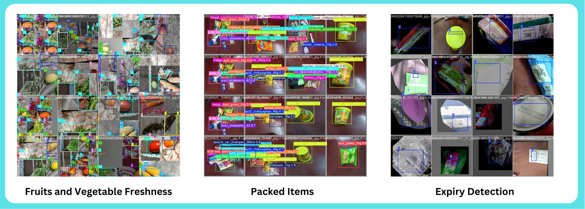

# Vision-Based Smart System for Quality Assessment  

  

Welcome to the **Vision-Based Smart System for Quality Assessment**, an innovative application that uses cutting-edge AI to revolutionize grocery quality checks. This system specializes in:  

1. **Detecting Expired Products**  
2. **Evaluating Freshness of Fruits and Vegetables**  

### **Documentation**  

📖 **For detailed setup instructions, visit our official docs:**  
[https://vision-system-docs.pages.dev/](https://vision-system-docs.pages.dev/)  

### **Key Features**  

#### 🌟 **Scalability**  
- **Add New Objects**: Supports dynamic addition of objects (beta feature).  
- Expands functionality with ease, ensuring adaptability to new requirements.  

#### 🤖 **Active Learning**  
- Continuously improves through interaction with new data, refining detection and assessment accuracy.  

#### ☁️ **Cloud-Based**  
- Fully hosted in the cloud for reliability and high availability.  

### **System Overview**  

1. **Backend**: High-performance processing on a private server powered by an **NVIDIA RTX 4090 GPU**.  
2. **Frontend**: User-friendly web interface for interaction and visualization.  
3. **Data Ingestion Pipeline**: Automated, scalable pipeline hosted on **AWS** for seamless data collection and preprocessing.  
4. **Training Results**: Insights from four specialized models.  
5. **Dataset**: Curated datasets optimized for grocery quality assessment.  

### **Repository Structure**  

| Module                  | Description                                               |  
|-------------------------|-----------------------------------------------------------|  
| **Backend**             | Hosted on a private GPU server for processing requests.   |  
| **Frontend**            | Interactive interface for users.                          |  
| **Data Ingestion**      | Cloud-hosted pipeline for seamless data flow.             |  
| **Training Results**    | Includes results from 4 advanced models.                 |  
| **Dataset**             | Curated datasets for training and evaluation.            |  

### **Future Enhancements**  
- 🚀 Enhance active learning for real-time adaptability.  
- 🛠 Improve the object addition feature to support broader use cases.  
- ☁️ Optimize cloud workflows for greater efficiency.  

